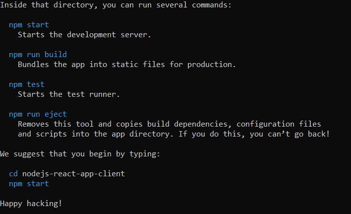

# we need to  uninstall create-react-app globally.
> npm uninstall -g create-react-app

### Step : 1 - Create React application using create-react-app template.
> npx create-react-app nodejs-react-chat-app-client 
>  

> application dependency [npm command] file : package.json \
> public page [Start] : public/index.html \
> application folder [root] : src \
> application Base [page] : src/index.js \
> application Base [component] : App.js \
> application custom [component] : src/components/ChatRoom.js

> ### Install Dependencies & Start Service in development modex 
> \
> cmd:/> cd nodejs-react-chat-app-client \
> cmd:/> npm install sockjs-client stompjs net \
> cmd:/> npm run start
